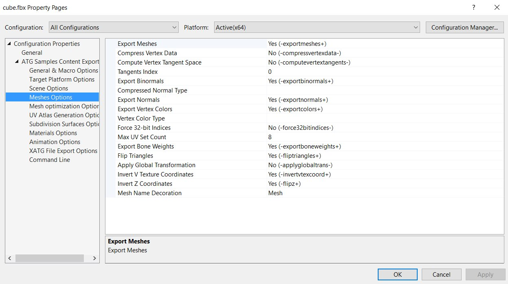

# ContentExporterMSBuild

Build sdkmesh files from fbx by adding them to your VS project. Comes with a property sheets GUI (below).

# How To Use

1. Copy BuildCustomizations folder into your project
2. Copy ContentExporter.exe into your project (or build it yourself, from https://github.com/walbourn/contentexporter)
3. Add references in your vcxproj to BuildCustomizations\ContentExporter.[props|xml]
  * See ContentExporterMSBuild.vcxproj as an example
4. Restart your Visual Studio if you currently have it open.
5. Add FBX files to your project (ie. right click on project -> Add -> Existing Items...)
6. Set the desired build options by right clicking your fbx and choosing "Properties..."
7. Just build, and it should hopefully work!

# Hello World

If you build and run the ContentExporterMSBuild.sln, that should "just work", and print out a bunch of info about cube.fbx.

Naturally, you can swap cube.fbx to test out your own scenes.

# Potential Issues

## FBX SDK

Haven't tested if it works without the FBX SDK installed, so consider installing that if there are problems.

## ContentExporter 32-bit

ContentExporter.props is designed assuming ContentExporter.exe was built in 64-bit.

If you want to use a 32-bit version of ContentExporter.exe, edit ContentExporter.props, and make the following changes:

1. Replace "\amd64\Tracker.exe" with "\Tracker.exe"
2. Replace "FileTracker64.dll" with "FileTracker32.dll"

## Debugging build errors

If you're running into weird build issues and you're not sure what's going on, you can try increasing MSBuild's debug level.

To do this:

1. Go in Visual Studio's "Tools -> Options -> Projects and Solutions -> Build and Run"
2. Increase "MSBuild project build output verbosity" to "Detailed"

From there, you'll be able to see the full output of the ContentExporter and its build scripts.

Please report any bugs on this repository! Either by posting in the issue tracker, or submitting your own fix through pull requests.
